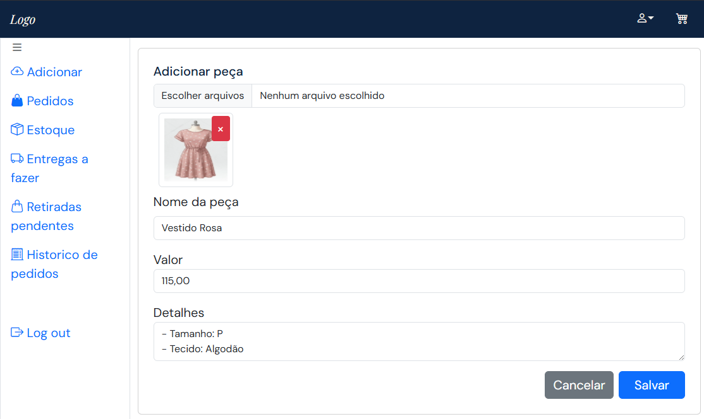
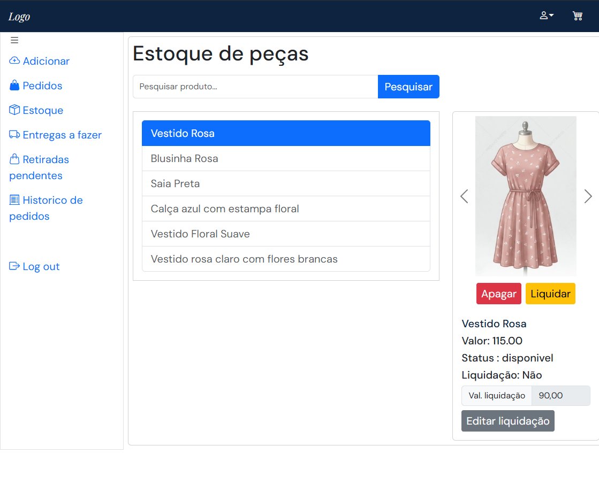
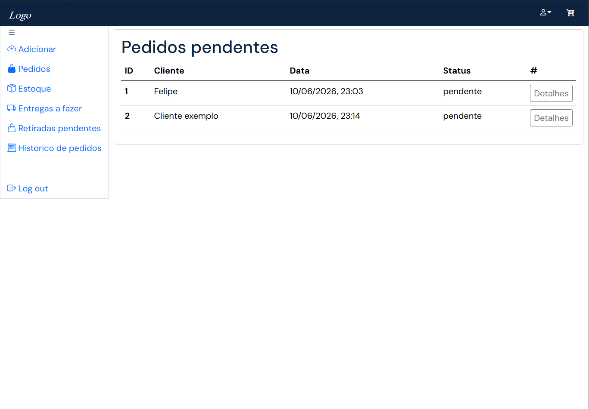
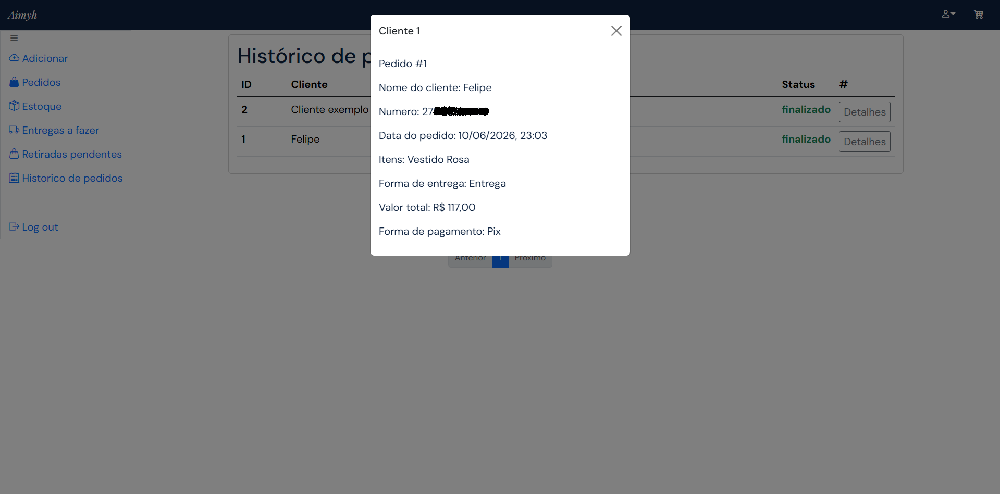
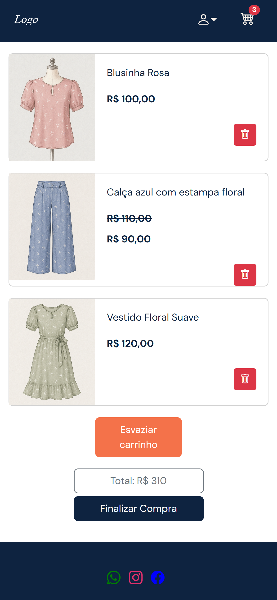
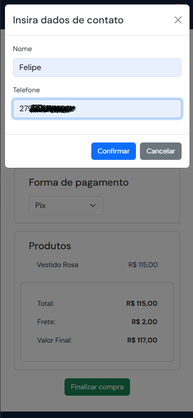

# Sistema Web para Loja de Roupas

Projeto desenvolvido como parte da graduação em Análise e Desenvolvimento de Sistemas, consistindo em um sistema web para gerenciamento de uma loja de roupas.

## Funcionalidades
### Área Pública
- Visualização de catálogo de produtos.
- Página de detalhes com múltiplas imagens.
- Carrinho de compras.
- Finalização de pedidos.
- Escolha de forma de entrega e pagamento.
### Área Administrativa
- Autenticação com JWT.
- Cadastro de produtos com upload de imagens.
- Controle de estoque.
- Gerenciamento de liquidações.
- Confirmação e cancelamento de pedidos.
- Controle de entregas e retiradas.
- Histórico de pedidos.
## Tecnologias Utilizadas
### Backend
- Node.js
- Express
- MySQL
- JWT
- Multer
### Frontend
- HTML
- CSS
- JavaScript
- Bootstrap 5

## Instalação
1. Clone o repositório.
2. Instale as dependências:
```bash 
npm install
```
3. Crie um arquivo .env com base em .env.example.
4. Configure o banco de dados MySQL.
5. Execute o servidor:
```bash
npm start
```

## Observações

Este projeto foi desenvolvido para fins acadêmicos e de aprendizado, simulando um sistema real de gerenciamento de loja de roupas.

## Imagens

### Painel administrativo
<table>
  <tr>
    <td>
      
    </td>
    <td>
      
    </td>
  </tr>
  <tr>
    <td>
      
    </td>
    <td>
      
    </td>
  </tr>
  <tr>
    <td>
      
    </td>
    <td>
      
    </td>
  </tr>
</table>

### Telas publicas

<table>
  <tr>
    <td>
      Catalogo
    </td>
    <td>
      Detalhes
    </td>
  </tr>
  <tr>
    <td>
      Carrinho
    </td>
    <td>
      Finalizar
    </td>
  </tr>
</table>